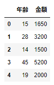
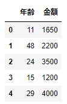
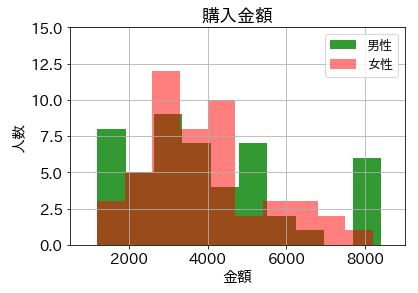

# ヒストグラムの表示
スーパーの来店客の購入金額を例にヒストグラムで表示

<br>

## CSVファイルから男性の来店客の購入金額を取得
```
frame1.head()
```


<br>

## CSVファイルから女性の来店客の購入金額を取得
```
frame2.head()
```


<br>

## スーパーの来店客の購入金額を男女別にヒストグラムで表示


<br>
